> - [astrbot](https://github.com/AstrBotDevs/AstrBot)
> - [napcat](https://github.com/NapNeko/NapCatQQ)
> - [astrbot-plugins](https://github.com/SHORiN-KiWATA/astrbot-plugins)

## astrbot + napcat

### 部署

直接参考文档 [通过 Docker Compose 部署](https://docs.astrbot.app/deploy/astrbot/docker.html#%E9%80%9A%E8%BF%87-docker-compose-%E9%83%A8%E7%BD%B2)，可以同时部署 astrbot 和 napcat

我这边因为之前已经部署了 napcat（为了实现 mc 那边的 bot），所以直接在之前的 `docker-compose.yml` 基础上改了改

原始的 napcat docker-compose.yml 文件可以参考 [NapCat-Docker](https://github.com/NapNeko/NapCat-Docker)

首先，创建一个文件夹作为项目目录，在目录下创建 docker-compose.yml 文件，内容可参考下方：

```yaml
# docker-compose.yml
services:
  napcat:
    image: mlikiowa/napcat-docker:latest
    container_name: napcat
    restart: unless-stopped
    networks:
      - mcbot
    ports:
      - 3000:3000
      - 3001:3001
      - 6099:6099
    environment:
      - NAPCAT_UID=1000
      - NAPCAT_GID=998
    volumes:
      - ./napcat/config:/app/napcat/config
      - ./ntqq:/app/.config/QQ
  astrbot:
    environment:
      - TZ=Asia/Shanghai
    image: soulter/astrbot:latest
    container_name: astrbot
    restart: unless-stopped
    ports:
      - "6185:6185"
    volumes:
      - ./data:/AstrBot/data
    networks:
      - mcbot
networks:
  mcbot:
    name: mc-bot
    external: true
```

### 创建共享网络

当前编排使用外部共享网络 mc-bot（因为之前是给 mc bot 用的，名字可以自己定一个，只要和上面的配置一致就行）

如果是首次部署，需要先创建网络

```bash
sudo docker network create mc-bot
```

### 运行

在项目目录执行下面的命令

启动

```bash
sudo docker compose up -d
```

查看日志

```bash
# 查看 astrbot 日志
sudo docker compose logs -f astrbot
# 或者直接查看容器
sudo docker logs -f astrbot

# napcat 同理
sudo docker compose logs -f napcat
sudo docker logs -f napcat
```

关闭服务

```bash
sudo docker compose down
```

## 配置

### napcat

参考文档 [通过 WebUI 配置 OneBot 服务](https://napneko.github.io/config/basic#%E9%80%9A%E8%BF%87-webui-%E9%85%8D%E7%BD%AE-onebot-%E6%9C%8D%E5%8A%A1)

在 napcat 的启动日志中，找到类似下面的信息，使用其中的 url 进入 webui：

```bash
[info] [NapCat] [WebUi] WebUi User Panel Url: http://127.0.0.1:6099/webui?token=xxxxx
```

登录 qq

在其 webui 网络配置中（如：[http://127.0.0.1:6099/webui/network](http://127.0.0.1:6099/webui/network)）新建一个 websocket 客户端并启用，配置参考：

其中 url `ws://astrbot:6199/ws` 的 `astrbot` 是 astrbot 容器的名字

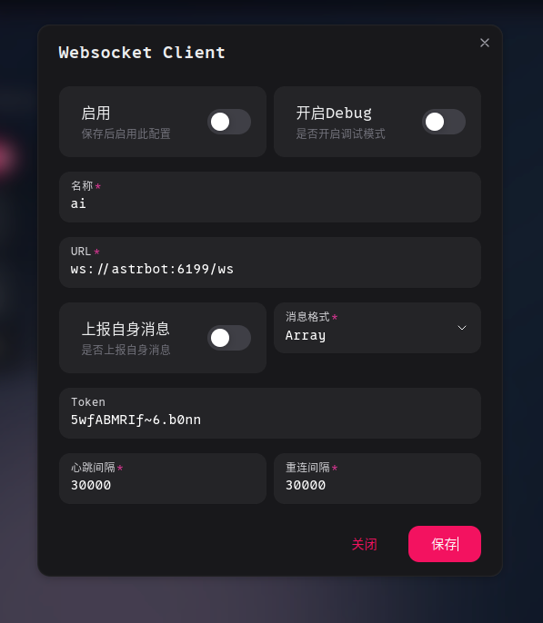

记住这里的 token，之后在 astrbot 那边会用上

### astrbot

参考文档 [🎉 大功告成 ](https://docs.astrbot.app/deploy/astrbot/docker.html#%F0%9F%8E%89-%E5%A4%A7%E5%8A%9F%E5%91%8A%E6%88%90)

在 astrbot 的启动日志中，找到类似下面的信息，使用其中的 url 和账号密码登录

首次登录请使用启动日志中打印的随机初始密码（用户名通常为 astrbot）。登录后请立即修改密码

```bash
 ✨✨✨
  AstrBot v4.25.1 WebUI is ready

   ➜  Local: http://localhost:6185
   ➜  Network: http://127.0.0.1:6185
   ➜  Network: http://172.18.0.4:6185
   ➜  Username: astrbot
 ✨✨✨
```

进入 webui，完成欢迎页面的引导

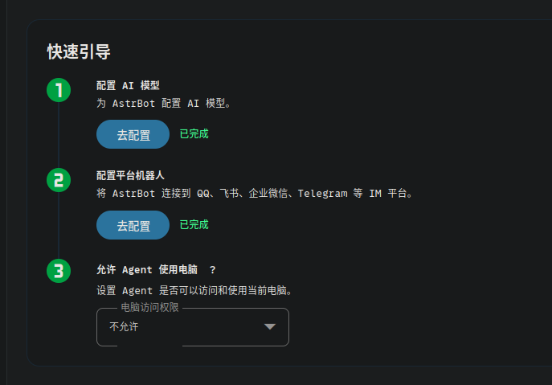

### ai 模型

首先是配置 ai 模型，将 deepseek 的 api key 直接填入

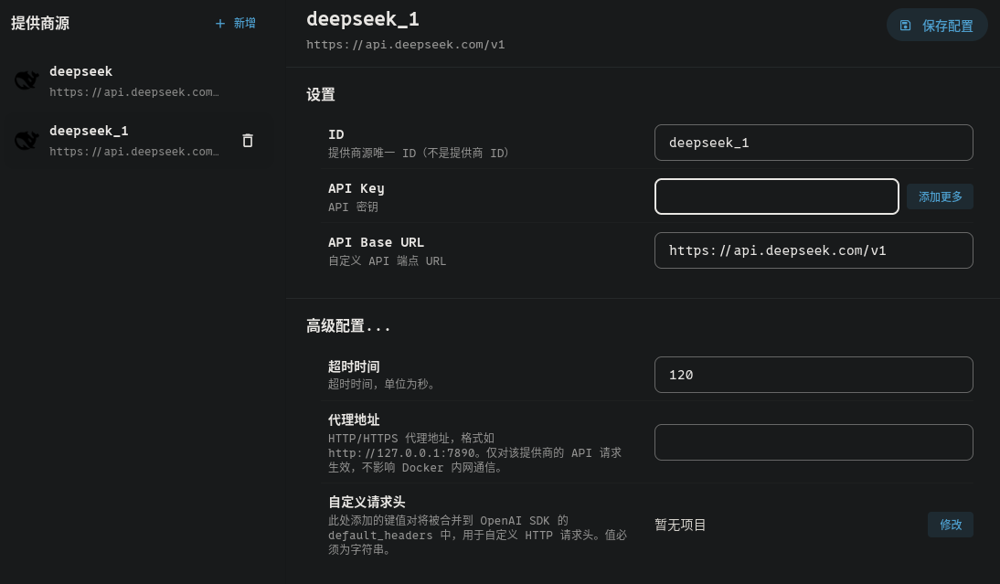

获取可用模型

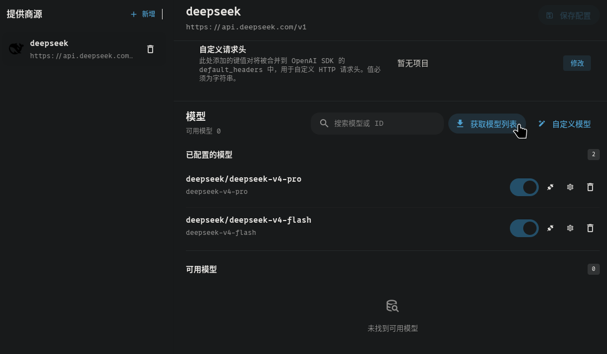

可编辑模型，修改 `自定义请求体参数`，设置禁用思考

键为 `thinking`，值类型为 `json`，值为 `{"type":"disabled"}`

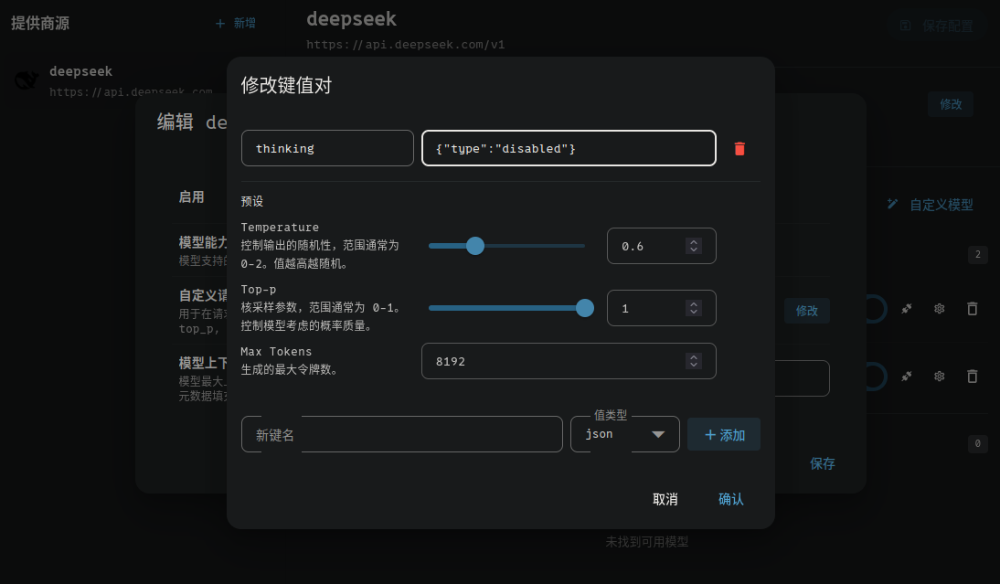

### 平台机器人

接下来配置平台机器人，使用 napcat

消息平台类型选择 `OneBot v11`，反向 Websocket Token 填入之前在 napcat 中生成的 token

然后保存，在左侧 `机器人` 一栏中启用即可

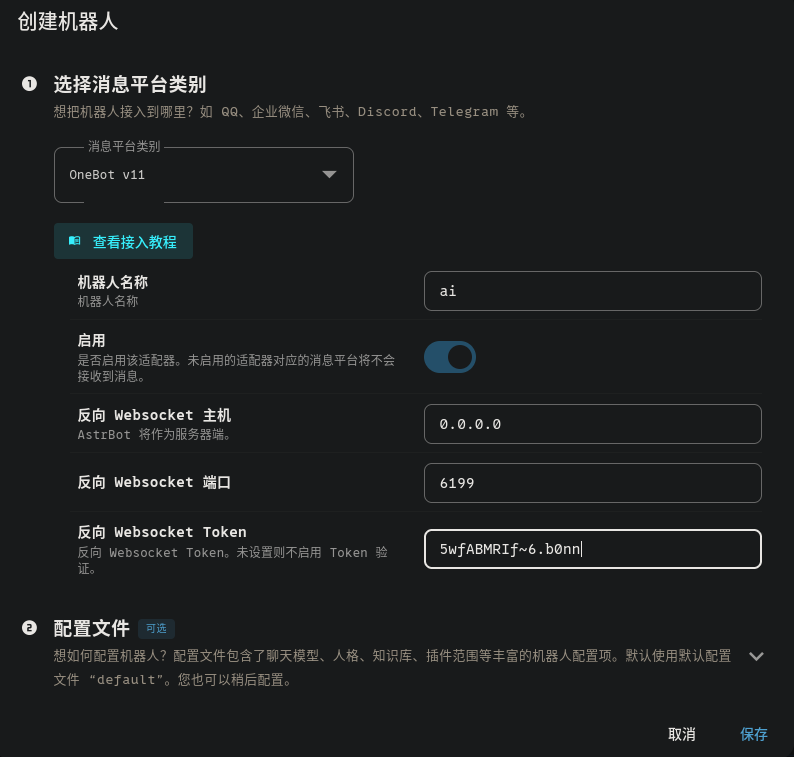

启用机器人后，bot 应该就能和 qq 对接成功了

### 人格

在 `普通配置/AI 配置` 中找到 `人格` 一栏，为 bot 编写一段合适的系统提示词

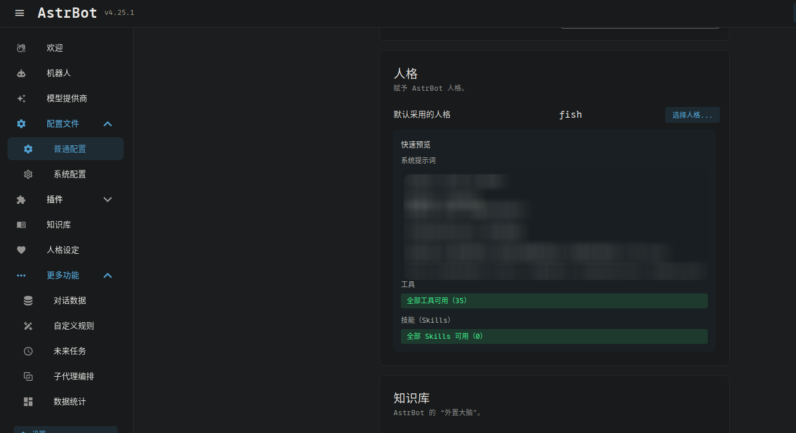

### 管理员

在 `普通配置/平台配置` 中找到 `基本` 一栏，将自己的 qq 号添加进去，以便在 qq 中使用管理命令

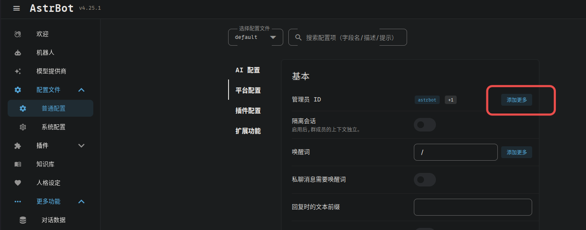

## 安装插件

在 webui 的插件市场中可以寻找自己喜欢的插件，不过我体验了一番，感觉不如直接用 shorin 的 [astrbot-plugins](https://github.com/SHORiN-KiWATA/astrbot-plugins) 合集

安装很简单，只需要在项目目录下：

```bash
# 克隆仓库
git clone https://github.com/SHORiN-KiWATA/astrbot-plugins.git

# 复制插件到 astrbot 的插件目录下
sudo cp -r astrbot-plugins/* data/plugins/

# 重启服务
sudo docker compose restart
```

然后重新进去 astrbot 的 webui，查看 `插件/AstrBot 插件` 即可看到插件安装成功

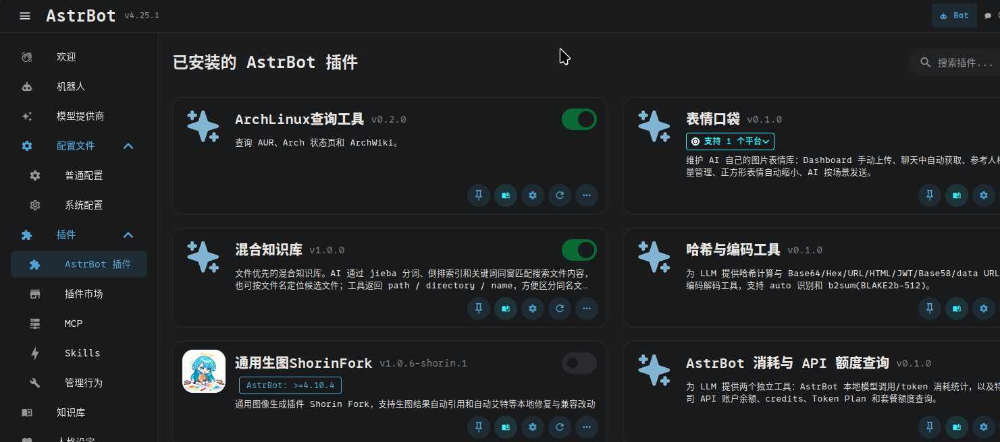

可自行选择是否启用/禁用插件，并对插件进行配置

除此之外，还可以进入插件的 dashboard 页面（如果有的话）

点击插件跳转到详情页面，点击 `dashboard/打开` 即可：

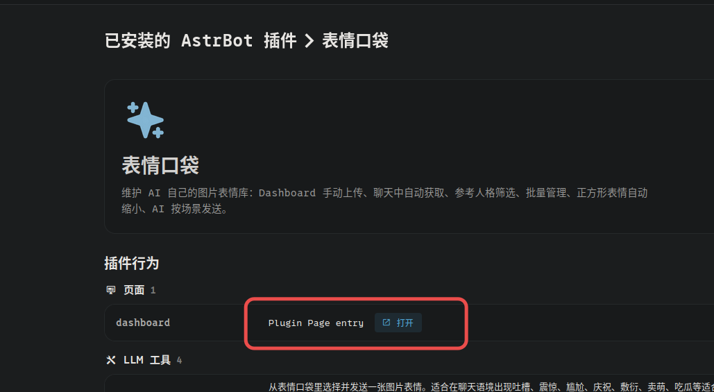

插件的具体功能和配置看文档

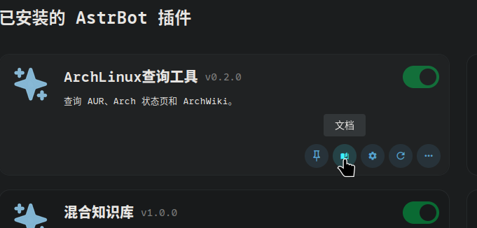

目前来说，我配置较多，对 bot 人性化影响较大的插件主要是 `真实上下文回复` 和 `人格记忆`，可以看着文档多微调一下试试
