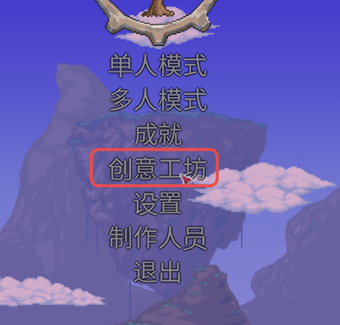
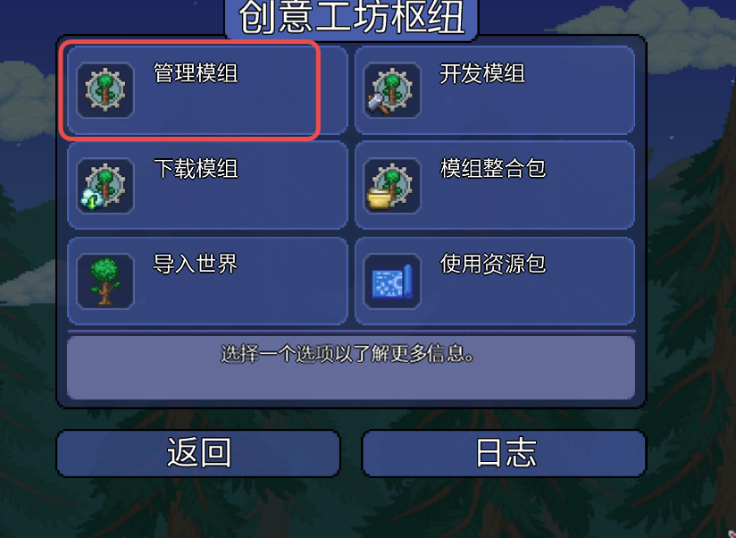
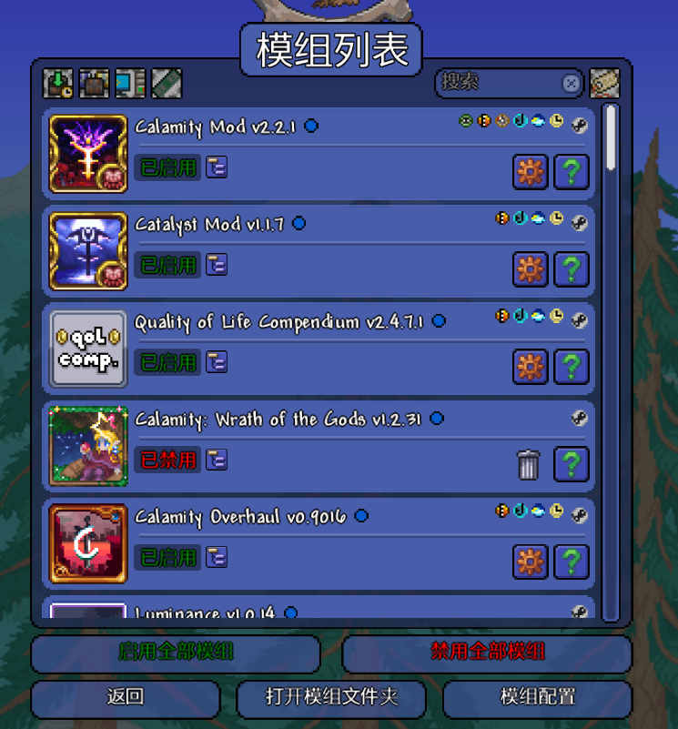
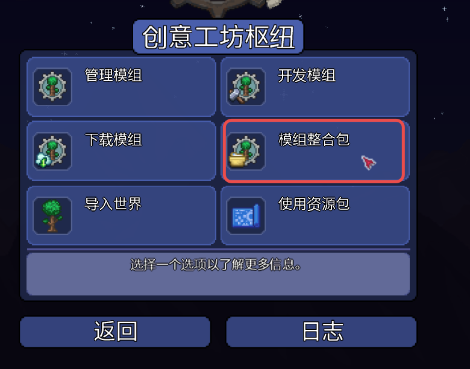
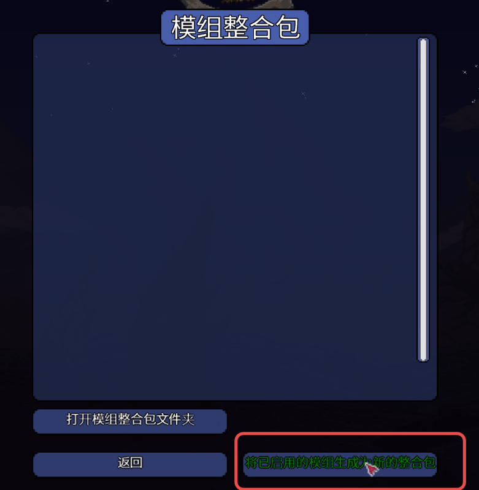
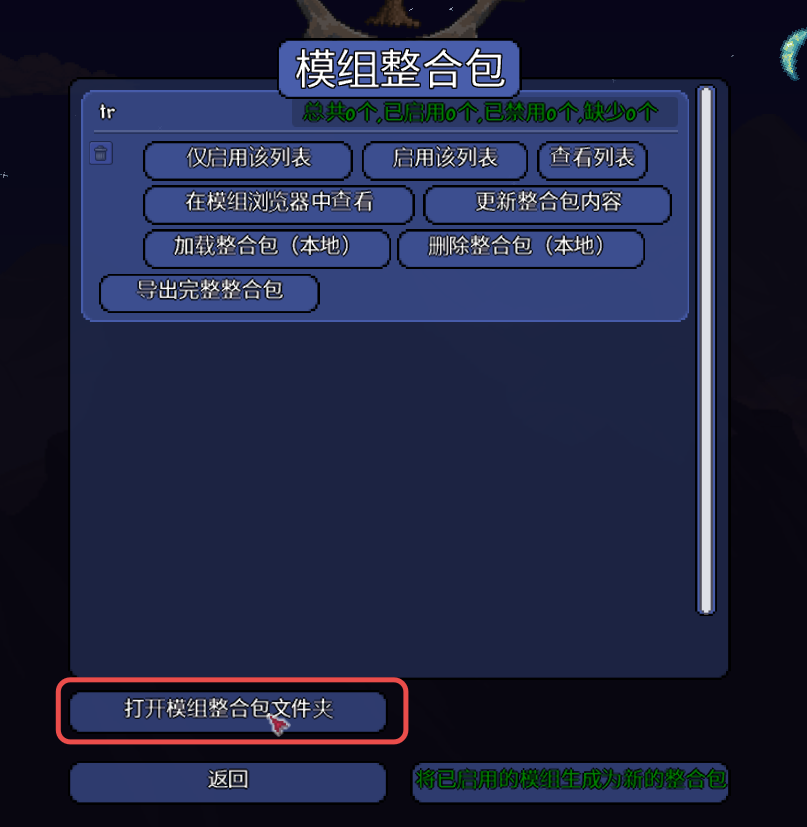
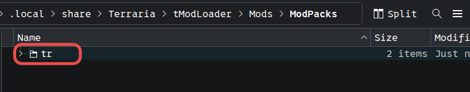
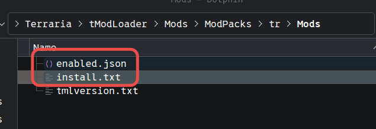

> - [TShock](https://github.com/Pryaxis/TShock)
>   - [TShock 权限说明](<https://github.com/Pryaxis/TShock/wiki/(%E4%B8%AD%E6%96%87)%E6%9D%83%E9%99%90%E8%AF%B4%E6%98%8E>)
>   - [TShockPlugin](https://github.com/UnrealMultiple/TShockPlugin)
> - [tModLoader](https://github.com/tModLoader/tModLoader)
> - [CaiBotLite](https://docs.terraria.ink/zh/other/CaiBotLite.html)

tr 服务器主要分两种，原版和 tmod，其中原版推荐使用 [TShock](https://github.com/Pryaxis/TShock) 部署

## TShock

可参考 [TShock 入门教程](https://docs.terraria.ink/zh/tshock/get-start.html) 进行部署，
并配置好 TShock 的用户/权限，改善游戏体验，如配置 `tshock.ignore.removetile` 忽略图格破坏速率检测，
具体配置参考 [TShock 权限说明](<https://github.com/Pryaxis/TShock/wiki/(%E4%B8%AD%E6%96%87)%E6%9D%83%E9%99%90%E8%AF%B4%E6%98%8E>)

从 [TShockPlugin](https://github.com/UnrealMultiple/TShockPlugin) 中可以找到一些插件和文档

## tModLoader

部署方式参考 [DedicatedServerUtils/README.md](https://github.com/tModLoader/tModLoader/blob/stable/patches/tModLoader/Terraria/release_extras/DedicatedServerUtils/README.md)，

### 获取 install.txt 和 enabled.json

关于获取 install.txt 和 enabled.json，需要先在 steam 中订阅好需要的 mod，启动 tmod 进入游戏

依次进入 创意工坊、管理模组，启用需要的 mod

再返回，进入 模组整合包，点击右下角将已启用的模组生成为新的整合包

随后打开模组整合包文件夹，进入对应的模组包目录，Mods 目录下即为需要的文件（`install.txt` 和 `enable.json`）

## bot

可以使用 [CaiBotLite](https://docs.terraria.ink/zh/other/CaiBotLite.html) 实现 QQ 官方机器人管理服务器，具体步骤参考 [CaiBotLite 使用指南](https://docs.terraria.ink/zh/other/CaiBotLite.html)
